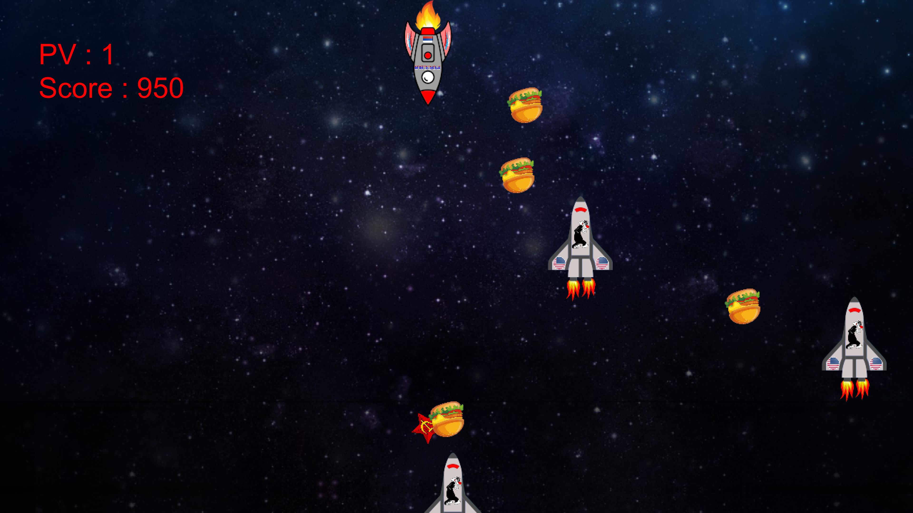

## Déplacements du joueur et tir
Se déplacer à gauche : Flèche gauche du clavier

Se déplacer à droite : Flèche droite du clavier

Tirer une balle : Touche espace du clavier

## Bonus / Maluces
 Vie supplémentaire

 Nombre de balles tiré + 2

 Nombre de balles tiré - 2

## Mode histoire
### Niveau 1 - Conquête de la Lune
Vous contrôlez Laïka, la chienne la plus téméraire de la nouvelle Russie étendue et vous devez vous rendre sur la face cachée de la lune, avant tout le monde, pour prouver aux terribles Américains que vous leurs êtes supérieurs et les prendre de court.

### Niveau 2 - Récupération du sélénium
En effet, la légende raconte que la face cachée de la lune est composée de Sélénite, un matériau rare et au combien efficace pour produire une énergie sans limite que l’inégalable Vladimir Vladimirovitch Poutine aimerait bien récupérer. Pour y parvenir, il faudra vous battre avec rapidité et précision contre les Marsiens qui tenteront le tout pour le tour afin de vous arrêter.

### Niveau 3 - Retour sur la Terre
Après avoir échappé aux Marsiens et récupéré le précieux sélénium, vous devez retourner en Russie.
Cependant l'affreux Biden ne vous laissera pas revenir indemne de votre épopée et vous enverra ses terribles bulldogs pour vous arrêter lors de votre retour sur terre.

## Mode arcade
Le mode arcade est infini. Les trois types d'ennemis peuvent apparaître. La difficulté augmente avec le temps.
